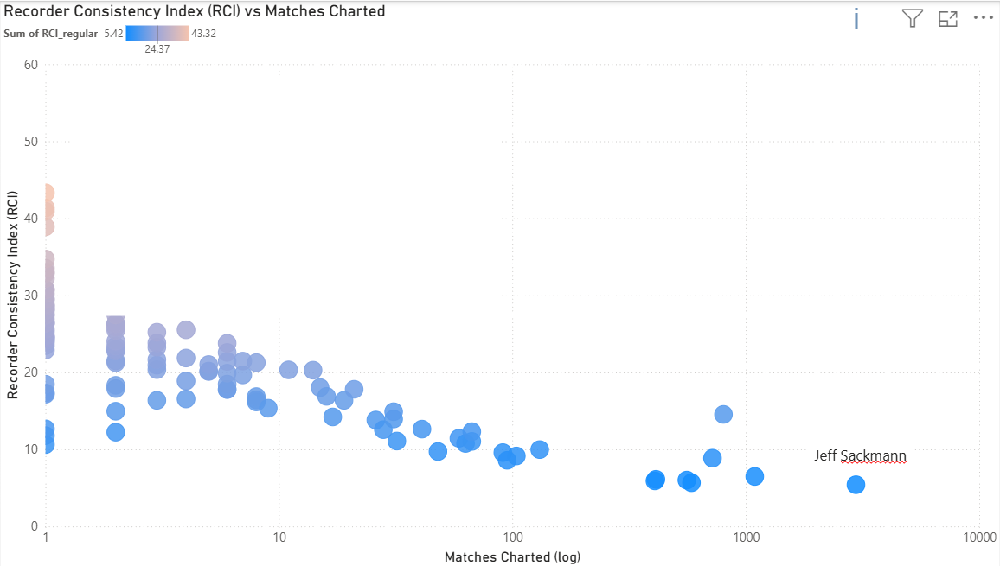
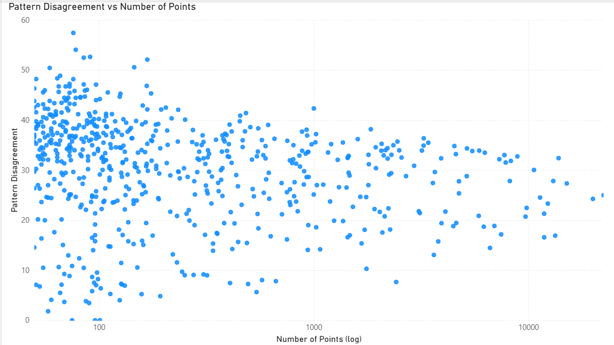
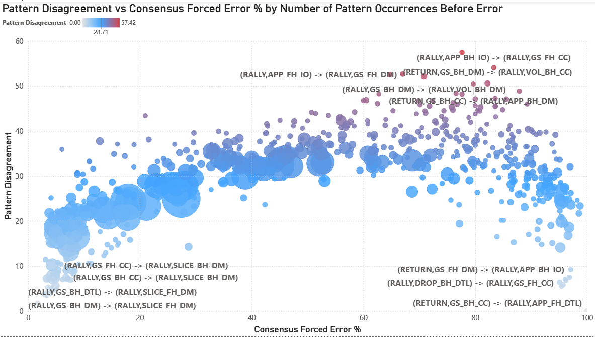
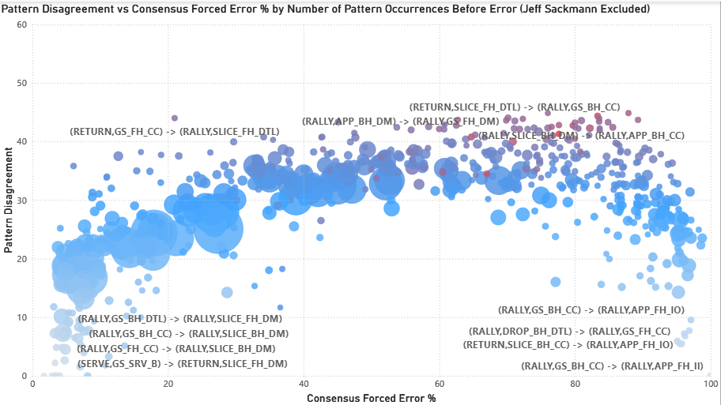
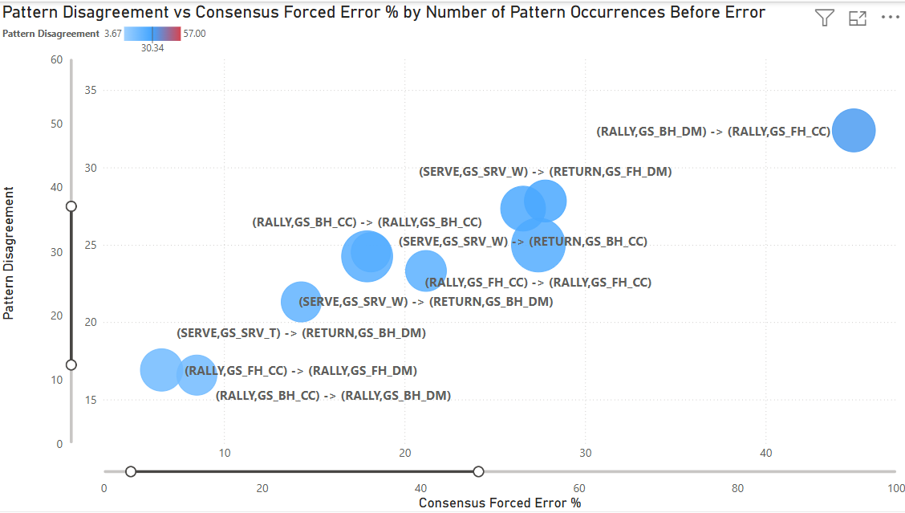
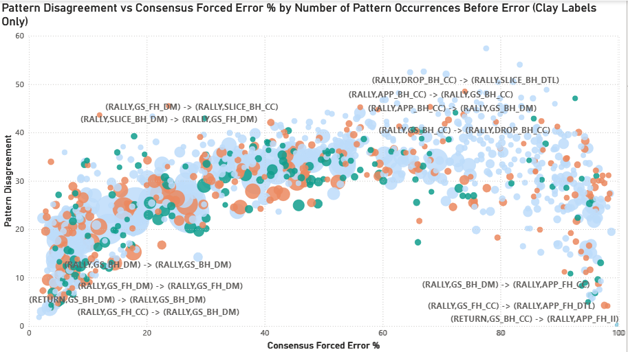
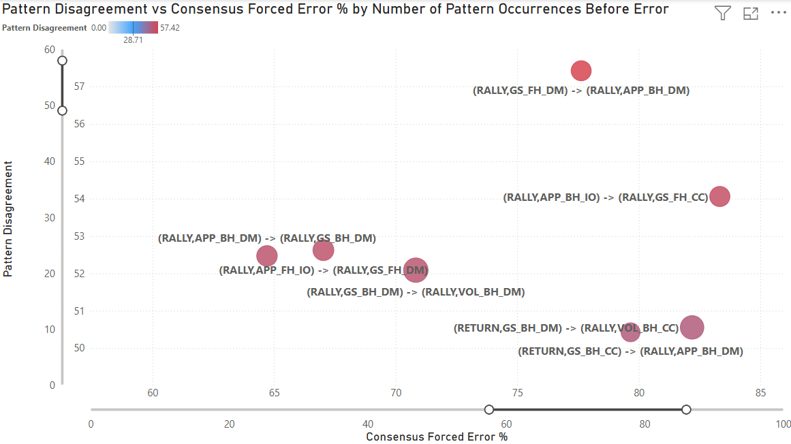
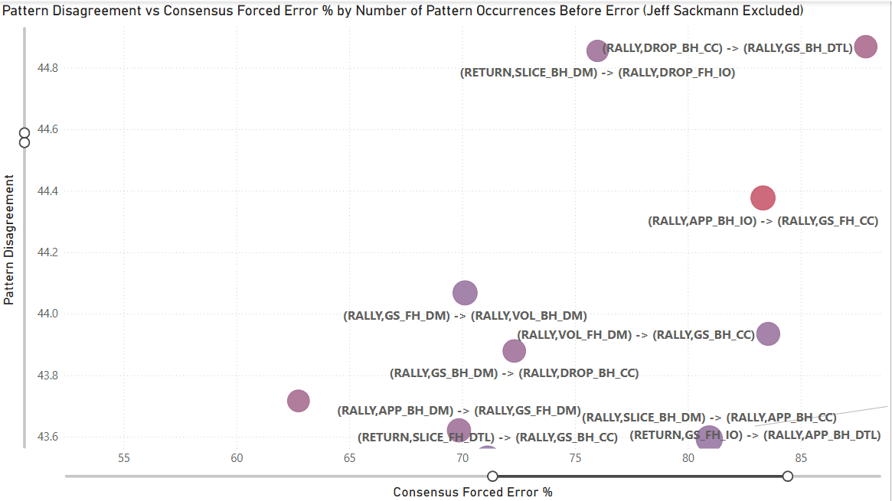

# Match Charting Project Charter Consistency Analysis

## Why This Matters

Tennis Abstract's [Match Charting Project] (https://www.tennisabstract.com/charting/meta.html) is an incredible resource. It has over 17,000 professional tennis matches charted by volunteers, freely available to anyone. But like any crowd-sourced dataset, there's an important question: how consistent are the charters?

This isn't about finding mistakes. It's about understanding whether different charters see the same patterns differently. And if so, helping everyone chart more consistently.

**Note:** Throughout this analysis, the terms Charter and Recorder are used interchangeably to refer to the individuals responsible for logging match data.

## What I Built

I wanted to answer a specific question: When two charters see the exact same shot sequence, do they classify errors the same way?

To create this analysis, I:

1. Built a graph database of ~8,800 MCP matches (~863,000 labeled error shots, of which ~560k occur in rallies of ≥3 shots)
2. Grouped points by identical shot sequences (the two shots immediately before the error)
3. Compared each charter's forced/unforced split against the population consensus for those same patterns
4. Analyzed consistency across different surfaces (hard/clay/grass)

**Sample size threshold:** Analysis includes only patterns with ≥50 total observations across all charters. This removes the worst statistical noise from rare sequences, though patterns near this lower boundary still exhibit more volatility than high-frequency sequences.

**Note:** The same shot pattern can legitimately be classified as forced or unforced depending on player ability and context. A short ball might be unforced for Alcaraz but forced for a lower-ranked player. However, each charter records many different players across their matches. When a charter observes the same pattern repeatedly across varied contexts, their classification tendency for that pattern becomes measurable. If they consistently label it as forced at a higher rate than the population average, that persistent deviation likely reflects their interpretive tendency rather than only the specific players they charted.

## The Recorder Consistency Index (RCI)

The Recorder Consistency Index (RCI) measures how much a charter's labeling deviates from the population norm across all patterns they've recorded.

**RCI = weighted mean absolute deviation from population forced %**

Lower is more consistent. Higher means more individual interpretation.

Sitting at the far right of the X-axis is our reference point (Jeff Sackmann), who accounts for roughly 33% of the total matches. The data shows a clear "learning curve": as charters accumulate matches, their RCI scores decrease.

This reflects a progression from inconsistent self-classification (same pattern called differently at different times) to stable internal frameworks. Charters work independently without knowing population norms, yet charters consistently responding to the same underlying tennis reality naturally converge. Systematic differences in how tactical intent (e.g., approach shots, modifiers) is recorded across charters can create finer-grained pattern distinctions for some contributors, increasing dispersion when compared to charters whose tagging is coarser or less explicit. Even Sackmann (lowest RCI) still diverges from the population on sequences involving approach shots and slices.

## Pattern Disagreement: The Core Finding

Pattern disagreement decreases with sample size (funnel shape on log scale), but even patterns with 10,000+ observations maintain disagreement of 20-40 (standard deviation in percentage points). This proves subjectivity isn't just noise from rare patterns. Even common tactical situations maintain persistent interpretive disagreement (20-40 std dev) that doesn't decrease with sample size.

This "Big Data" view maps Pattern Disagreement (Y-axis) against the Consensus Forced Error Percentage (X-axis) for every tactical sequence in the dataset.

A significant "Arch" emerges. Disagreement is lowest at the extremes:
- **Far left (0-20% forced):** Patterns where charters overwhelmingly agree the resulting error is unforced (e.g., slice down the middle where the next shot is an error)
- **Far right (80-100% forced):** Patterns where charters overwhelmingly agree the resulting error is forced (e.g., aggressive approach shots where the next shot is an error)

Disagreement peaks in the 'Grey Zone' (~50–80% Forced Rate) where tactical interpretation matters most. The red gradient at the top highlights "High-Entropy" sequences. These are dominated by down the middle shots, volleys, and transition play where even experienced charters fundamentally disagree about whether pressure was created.

Disagreement stabilizes around ~30 percentage points for high-frequency patterns. This suggests a stable level of interpretive variance that persists even in common tactical situations. The most extreme disagreement values (>40) are concentrated in low-sample patterns and likely reflect some statistical volatility in addition to structural disagreement.

This arch reveals something profound: **human subjectivity in tennis isn't random**. It concentrates in specific tactical situations where pressure assessment is genuinely ambiguous.

When Jeff Sackmann is excluded from the analysis (removing 33% of all matches), the subjectivity arch persists but with reduced magnitude. Peak disagreement drops from ~57 to ~45. The detailed implications of this test are discussed below.

By filtering for the Top 10 most frequent patterns (representing the vast majority of professional tennis play), we move from "noise" to "signal." These are the bread-and-butter sequences of professional tennis: serve returns, cross court baseline rallies, and common tactical situations.

Even within these high-frequency patterns, disagreement ranges from 15-35 (standard deviation). The most common sequences in tennis (patterns that occur thousands of times across the dataset) still generate meaningful interpretive disagreement.

## Surface Effects

The disagreement arch persists across all three surfaces with modest distributional shifts (bubble size = number of observations). Clay patterns concentrate slightly toward lower forced %, grass toward higher forced %, and hard court shows balanced distribution. This suggests surface speed modestly influences baseline forced/unforced rates, but the 'Grey Zone' of tactical ambiguity remains consistent across surfaces.

Surface-specific tactical patterns emerge (e.g., slice and drop shot sequence disagreement elevated on clay), though small sample sizes (n=50-100 for some combinations) limit interpretation.

## The "Problem Children": Where Charters Struggle Most

This visualization isolates the top 7 patterns with the highest disagreement. The highest disagreement pattern is (RALLY, GS_FH_DM) -> (RALLY, APP_BH_DM) with a disagreement (standard deviation) of 57 over 76 points. As noted earlier, this pattern hovers near the lower sample size threshold (50 points), showing how statistical volatility and human subjectivity combine to create extreme disagreement.

In this sequence, a neutral forehand down the middle is followed by a backhand approach shot down the middle. These sequences dominate the high-disagreement list because pressure depends almost entirely on depth, pace, and timing rather than horizontal direction, making classification especially ambiguous without tracking data. While the population mean is 77% forced, the distribution is polarized: high-volume charters like Sackmann (33 points observed) rate it at 97% forced, while six lower-volume recorders who saw it once rated it 0% forced. This demonstrates how individual interpretive frameworks, rather than just "noise," drive the 57-point standard deviation in the 'Grey Zone.' The charters that recorded this pattern fundamentally disagree about whether an approach shot down the middle creates enough pressure to force an error from the opponent.

The following displays the same chart with Sackmann's matches excluded. 

When Jeff Sackmann is excluded from the analysis, the subjectivity persists through patterns like (RALLY, DROP_BH_CC) -> (RALLY, GS_BH_DTL), which carries a disagreement (standard deviation) of 44.87 over 66 points. This pattern, a backhand crosscourt dropshot followed by a backhand groundstroke down the line, leading to an error, reveals a significant rift in how the "field" interprets transition play. While the population mean is 88%, the distribution remains heavily polarized: 12 recorders (60% of the sample) classified the sequence as 100% forced, while 6 low-volume recorders who saw it once rated it 0% forced. This confirms that even without the dataset's primary anchor, a near-50-point standard deviation remains, proving that the 'Grey Zone' is a structural reality of the sport rather than an artifact of one expert’s influence. In this case, charters fundamentally disagree about whether the tactical pressure of defending a down-the-line reply after hitting a dropshot is enough to warrant a forced error classification. This highlights a rift in how we judge 'recovery' errors: is the player forced by the sprint they triggered, or is the missed recovery an unforced failure of their own tactical play?

Comparing the two views reveals the nature of disagreement:

**Pattern composition shifts:**
- Down the middle shots: 23 total → 15 total (remains dominant)
- Approach shots: 13/20 → 9/20 (drops, suggesting metadata effects)
- Slice shots: 2/20 → 6/20 (increases, revealing field-specific disagreements)
- Volleys: 4/20 → 4/20 (stable)

**What this tells us:**
Some disagreement reflects metadata inconsistency (approach shot tagging), but core tactical ambiguity (down-the-middle sequences, quality assessment) persists regardless of dataset composition. The field has its own contentious patterns that emerge when the highest-volume charter is removed.

## The Sackmann Exclusion Test: What Does The Flattening Mean?

A critical stress test involved removing Sackmann (33% of all matches) to see if the "Subjectivity Arch" collapsed. The goal was to ensure the findings weren't simply measuring "how close are charters to Sackmann" rather than revealing genuine structural disagreement in the dataset.

The arch did not collapse. Peak disagreement dropped from ~57 to ~45, a reduction of about 20%. But the arch's shape, the 'Grey Zone' location (50-80% forced), and the same tactical patterns (sequences involving approach shots, slices, net play) all remained at the top. The arch compresses slightly. The core finding does not change.

**What the flattening likely reflects:**

1. **Metadata completeness variation:** Systematic differences in how tactical intent (e.g., approach shots, modifiers) is recorded across charters can create finer-grained pattern distinctions for some contributors, increasing dispersion when compared to charters whose tagging is coarser or less explicit.

2. **Volume leverage effect:** With 33% of total observations, removing one internally consistent contributor necessarily reduces dispersion across charters. This is a mechanical property of variance, not a correction.

3. **Field homogeneity:** The remaining charters share more similar metadata practices and classification tendencies, reducing variance when compared to themselves.

**The key insight:** The persistence of the disagreement structure after removal confirms that the effect is not driven by any single individual. The remaining disagreement (~45 standard deviation) is still significant and structurally identical.

**This proves two things:**

**Structural Reliability:** These patterns are not artifacts of one expert's interpretation. They represent structurally ambiguous tactical moments in tennis where pressure assessment is genuinely subjective.

**Crowdsourced Consistency:** The collective field of charters experiences the same interpretive friction as elite experts. The RCI isn't measuring "Sackmann-likeness." It's measuring a charter's ability to navigate universal 'Grey Zones' that exist in the sport itself.

## What This Analysis Shows

**Disagreement is structured.** Specific patterns generate consistent disagreement across charters, surfaces, and experience levels. The 'Grey Zone' (50-80% forced) is stable. Forced/unforced ambiguity isn't random, it's tied to specific tactical situations.

**Experience produces consistency.** Charters move from noisy classification to stable internal frameworks independently, without knowing population norms. This validates that charting expertise is real and developable.

**Consensus emerges organically.** Independent charters naturally converge when responding to the same underlying tennis reality, validating crowd-sourced approaches.

**Consensus does not equal correctness.** No ground truth exists for forced/unforced, it remains subjective. This analysis shows where charters align and diverge, not who's "right."

## What This Means for Charters

This analysis isn't a report card. It's a tool.

If you're a charter and you want to know:
- Which specific patterns you classify differently
- How your surface-specific tendencies compare to the population
- Where you might want to recalibrate

**Email me (address listed below).** I can generate a personalized breakdown showing exactly where you diverge and what the population consensus looks like for those same sequences.

## The Bigger Picture

MCP's consistency doesn't come from eliminating individual interpretation. It comes from **volume and transparency**.

Knowing the structure of disagreement enables better decision-making:

**For training:** Focus new charters on high-disagreement patterns where classification is genuinely ambiguous and explicit guidance would help.

**For analysis:** Weight matches appropriately when disagreement levels vary. Patterns with high consensus can be used confidently for population-level statistics; patterns in the 'Grey Zone' require more careful interpretation.

**For quality improvement:** Charters who want feedback can identify their specific areas of deviation. Not to "fix" them (there may be no right answer), but to understand where their interpretation differs from the crowd.

**For research:** The graph structure makes selection bias visible and correctable, enabling researchers to apply appropriate weights for player coverage, surface distribution, and tournament stage representation.

## A Note on Selection Bias

This analysis focuses on charter consistency (how charters label identical patterns), but there's a related question: selection bias (which matches get charted at all).

MCP isn't a random sample of professional tennis. The dataset skews toward top ATP and WTA players, high-profile tournaments, matches with available video, and players that individual charters prefer to follow. This doesn't invalidate the consistency analysis: two charters seeing the same Djokovic point should still classify it the same way, but it does matter for population-level conclusions about tennis as a whole.

The same infrastructure that enables consistency auditing also makes selection bias visible and correctable. Player coverage, surface distribution, tournament stage, and recorder preferences can all be queried directly. Once these patterns are visible, researchers can apply selection weights when doing population-level analysis, adjusting for the fact that we have 250+ Alcaraz matches but only 20 from players ranked 80+.

Both recorder bias (labeling) and selection bias (coverage) matter. Both are now addressable.

## Technical Details

### Data
- 8,800+ matches from MCP
- ~863,000 labeled error shots, of which ~560k occur in rallies of ≥3 shots (serve → return errors are structurally excluded because the model requires two prior shots to define a sequence)
- Shot sequences normalized (serves by target, groundstrokes by direction, intent, shot modifiers)
- Surfaces standardized (hard/clay/grass)

### Method
- Graph database (Neo4j) for structural relationships
- Pattern-level aggregation: identical two-shot sequences immediately before the error
- Variance decomposition: Evaluated the impact of charter identity using two complementary models:
    - Linear Regression: Analyzed aggregate forced error percentages (via recorder_variance_explained.py) to identify high-level trends.
    - Logistic Regression: Analyzed individual point-level classifications (0 or 1) from Neo4j (via recorder_variance_pointlevel.py) using McFadden pseudo-R^2 to measure predictive power.
- Recorder consistency measured as weighted mean absolute deviation

**Note on RCI calculation:** The RCI weights each pattern by sample size (n), giving more weight to patterns the charter has seen many times and less weight to rarely-observed patterns. This creates different dynamics for high-volume vs. low-volume charters:

**High-volume charters** may diverge from population consensus on specific patterns, but if they align with consensus on the majority of their patterns, those conforming patterns (with large n) heavily outweigh the divergent ones, resulting in low RCI despite having areas of systematic disagreement.

**Low-volume charters** can have RCI inflated by a modest number of divergent patterns, because they haven't accumulated enough conforming patterns to offset them. Small sample sizes per pattern also create noisy estimates that randomly deviate from population norms.

The "learning curve" reflects charters moving from inconsistent self-classification (high variance, noisy estimates) to consistent self-classification (stable estimates that naturally converge toward population norms). However, low RCI indicates alignment with the crowd's classification tendencies, not correctness. No ground truth exists for forced/unforced classification.

### What I Controlled For
- **Shot pattern** (the specific two-shot sequence leading to the error)
- **Surface type** (hard/clay/grass)
- **Sample size** (minimum 50 observations per pattern)

### What I Measured
- Recorder-specific forced % vs. population forced % for identical patterns
- Standard deviation of forced % classification across charters for each pattern
- Pattern × surface × recorder anomalies (>25pp deviation flagged)

**Note on shot granularity:** This analysis captures shot intent (approach, passing, drop, lob) and modifiers (slice, volley) from the graph database. Metadata completeness varies across charters. Some consistently tag approach shots and other tactical intents, while others don't. This affects interpretation of patterns involving these shot types.

## Code & Reproducibility

The analysis pipeline includes:
- Point-level Neo4j queries (deterministic shot sequence parsing)
- Pattern aggregation and consensus calculation
- Variance decomposition: linear regression (aggregate forced %) and logistic regression (point-level forced 0/1; pseudo-R²)

[View the code for charter consistency, RCI, and pattern-level error analysis on GitHub](https://github.com/ramizheman/mcp-charter-consistency)

See README_Charter_Analysis.md for file descriptions. Note - Graph creation code not included.

## What's Next

This analysis came about while developing a natural language interface for MCP data. This required building a tree-based structure at the point level and linking it to a shot sequencer for shot-level questions. Once these were created, a graph became a natural evolution, which provided the relationship data needed to create this analysis.

I'm presenting this work at the *Connecticut Sports Analytics Symposium* (poster session/demo).

This graph infrastructure enables additional analysis of MCP data. Contact me if you're interested in discussing other applications.

## Contact

**Email:** rami.zheman [at] gmail.com  
**LinkedIn:** [linkedin.com/in/ramizheman](https://www.linkedin.com/in/ramizheman)

---

## Acknowledgments

Thank you to Jeff Sackmann and all MCP contributors for making this dataset possible. Thank you to Stephanie Kovalchik for thoughtful feedback on this analysis.

This work is intended to **support** the Match Charting Project community, not critique it. MCP is one of the most valuable open tennis datasets in existence, and it only gets better when we understand its structure.
